# Vienna Vulkan Post-Processing Library (VVPPL)

VVPPL is a small C++ library that applies a chain of post-processing effects to a Vulkan image.
It records its work into a command buffer of the host application, so it needs no queue, command
pool, fence or render pass of its own. Every effect is a compute shader written in Slang.

The library was written for the master's thesis *Post-processing library for Vulkan game engines*
at the University of Vienna (2026).

## Requirements

- Vulkan 1.1 or higher
- The Vulkan SDK with `slangc`, which compiles the shaders during the build, and the validation
  layer for the test
- CMake 3.15 or higher and a C++20 compiler

The library has only been tested on macOS with MoltenVK.

## Building and testing

```sh
cmake -S . -B build
cmake --build build
ctest --test-dir build
```

The test (`tests/testlib.cpp`) creates a device, clears a 256×256 image to red, applies all effects
and writes the result to `build/tests/output.ppm`. It runs with the validation layer enabled.

## Adding the library to a project

With CMake's `FetchContent`:

```cmake
include(FetchContent)
FetchContent_Declare(vvppl
  GIT_REPOSITORY https://github.com/orcunilker/Vienna-Vulkan-Post-Processing-Library.git
  GIT_TAG v1.0)
FetchContent_MakeAvailable(vvppl)

target_link_libraries(my_app PRIVATE vvppl)
```

`add_subdirectory` on a copy of the repository works the same way. The test is only built when the
library is the top-level project.

Hosts that load Vulkan with [volk](https://github.com/zeux/volk) set `VVPPL_USE_VOLK` to `ON`
before `FetchContent_MakeAvailable`. The library then calls the host's function pointers instead
of linking the Vulkan loader.

## Usage

```cpp
#include "VVPPL.h"

// once, after the device exists
vvppl::PostProcessing pp(device, physicalDevice, width, height, framesInFlight);
pp.addTonemap().exposure = 1.2f;
auto& vignette = pp.addVignette();

// any time between two frames
vignette.intensity = 0.8f;

// every frame, after rendering into image, with image in VK_IMAGE_LAYOUT_GENERAL
pp.apply(cmd, image, image, frameIndex);

// after the window size changed and vkDeviceWaitIdle
pp.resize(newWidth, newHeight);
```

`apply` reads `src` and writes `dst`; both can be the same image, for example a swapchain image.
The host is responsible for the following:

- The command buffer is recording, outside of a render pass or dynamic rendering, and its queue
  family supports graphics and compute.
- `src` and `dst` have the size given to the constructor or `resize`, are in
  `VK_IMAGE_LAYOUT_GENERAL`, are single-sampled and have a color format that supports blits.
  sRGB formats are fine.
- `src` has `VK_IMAGE_USAGE_TRANSFER_SRC_BIT`, `dst` has `VK_IMAGE_USAGE_TRANSFER_DST_BIT`.
- After `apply`, `dst` was last written by a transfer. The next use of `dst` needs a barrier from
  `VK_PIPELINE_STAGE_TRANSFER_BIT` and `VK_ACCESS_TRANSFER_WRITE_BIT`.
- `frameIndex` is less than `framesInFlight`, and frames in flight at the same time use different
  indices.
- The GPU no longer uses the library when `resize` is called or the instance is destroyed.

`include/VVPPL.h` documents the whole interface. Running `doxygen` in the repository root turns it
into an HTML reference in `build/doxygen/html`.

## Effects

Each `add` method returns a reference to the settings of its effect. The chain always runs in the
order of this table, no matter in which order the effects were added. Removing an effect keeps its
settings, and adding it again returns them.

| Order | Effect | Method | What it does |
|---:|---|---|---|
| 1 | Chromatic aberration | `addChromatic` | Splits red and blue apart towards the border |
| 2 | Vignette | `addVignette` | Darkens the image towards the corners |
| 3 | Tone mapping | `addTonemap` | Maps HDR colors to 0..1 with an ACES curve |
| 4 | Color grading | `addColorGrade` | Gain, lift, gamma, contrast and saturation |
| 5 | Hue segmentation | `addSegmentation` | Replaces every color by the nearest of a few hues |
| 6 | Color highlight | `addHighlight` | Keeps colors close to a key color, desaturates the rest |
| 7 | Greyscale | `addGreyscale` | Replaces the color by its luminance |
| 8 | Invert | `addInvert` | Inverts every color channel |
| 9 | Solarization | `addSolarize` | Inverts every channel above a threshold |
| 10 | Sabattier effect | `addSabattier` | Mirrors every channel above a threshold |
| 11 | Emboss | `addEmboss` | 3×3 relief filter |
| 12 | Sobel | `addSobel` | Edge detection on the luminance |
| 13 | Speed lines | `addSpeedLines` | Radial white lines around the center |
| 14 | Film grain | `addFilmGrain` | Random noise that changes with time |
| 15 | Dithering | `addDither` | Ordered 4×4 pattern against banding in 8-bit output |

Each screenshot shows one effect alone on the same scene, rendered with version 3 of the Vienna
Vulkan Engine at 960 × 540 and with settings chosen per effect. The dithering image uses strength 32
instead of 1, so that the pattern becomes visible.

|  | 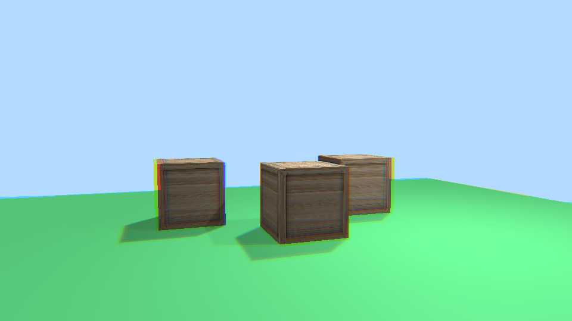 | 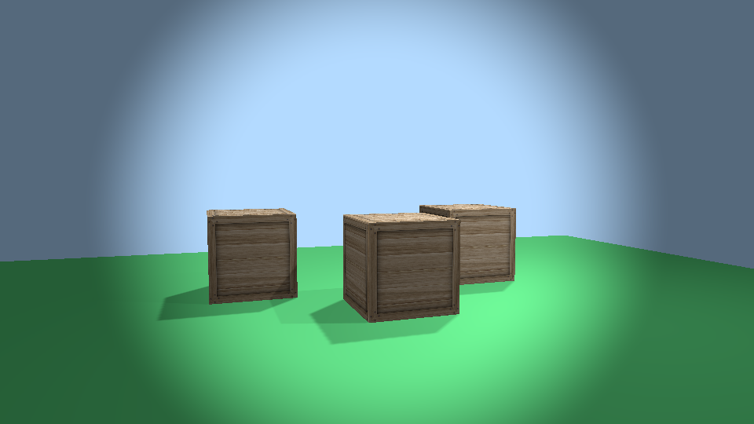 | 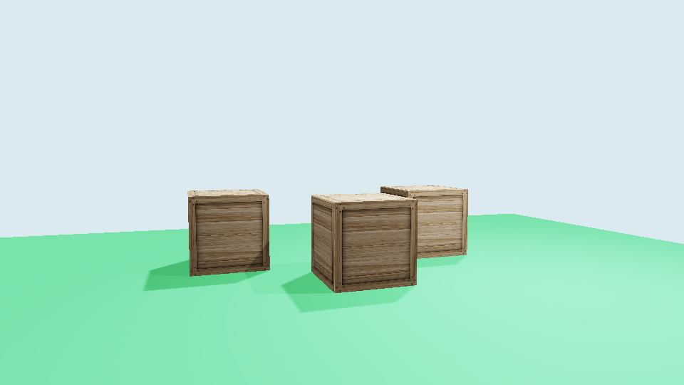 |
|:-:|:-:|:-:|:-:|
| No effect | Chromatic aberration | Vignette | Tone mapping |
| 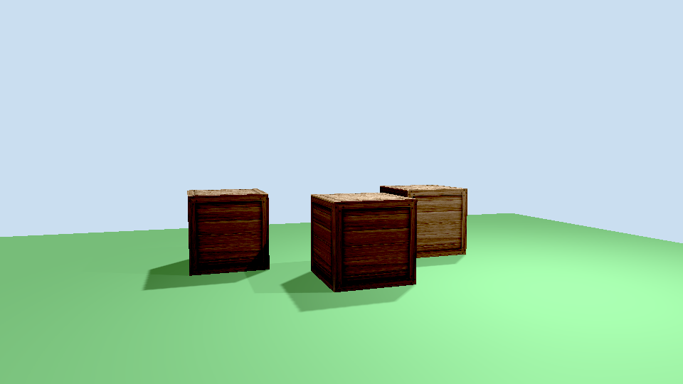 | 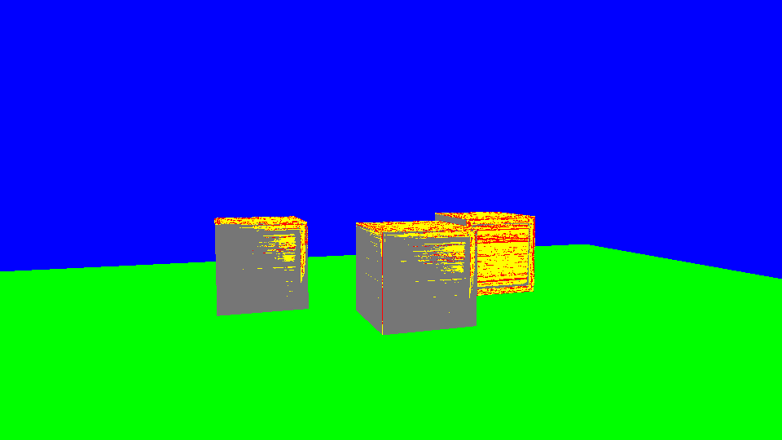 | 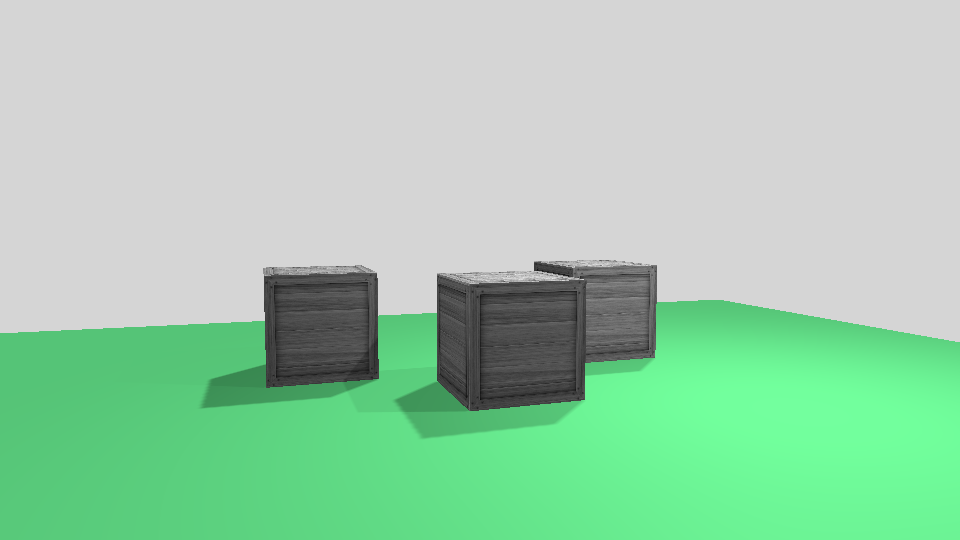 | 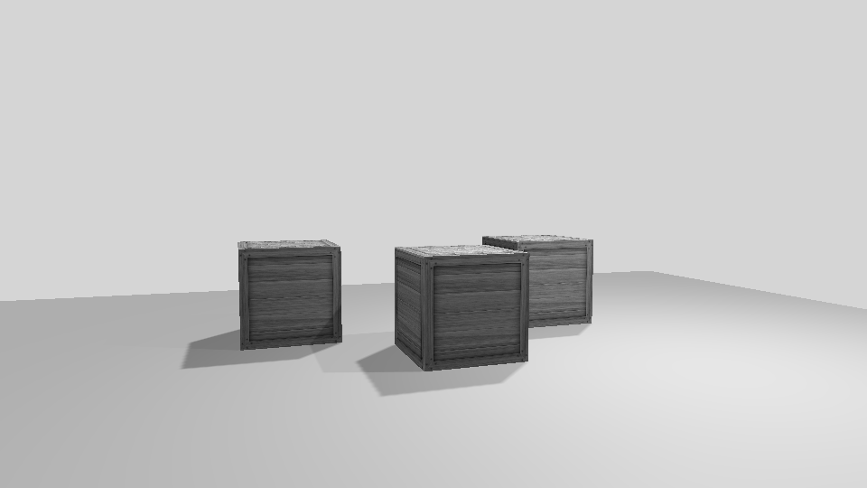 |
| Color grading | Hue segmentation | Color highlight | Greyscale |
| 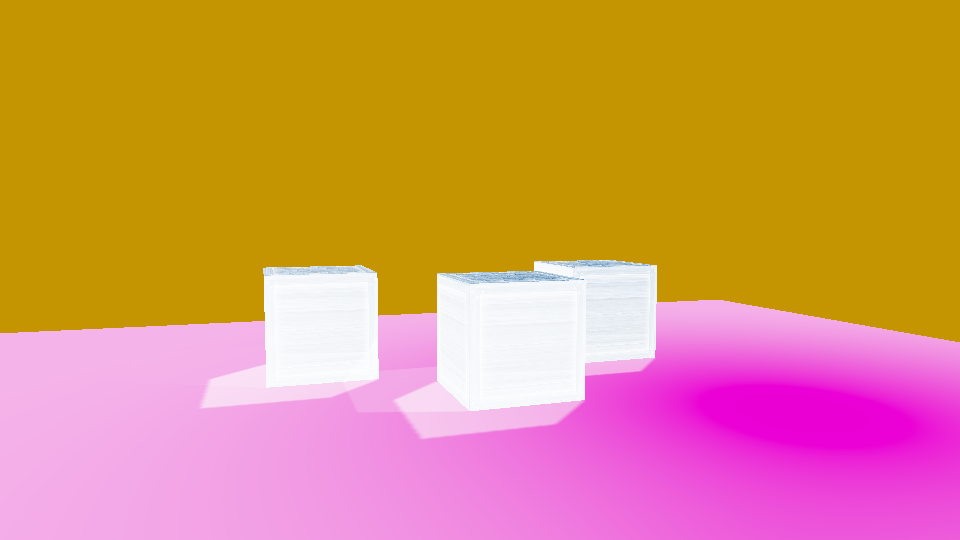 | 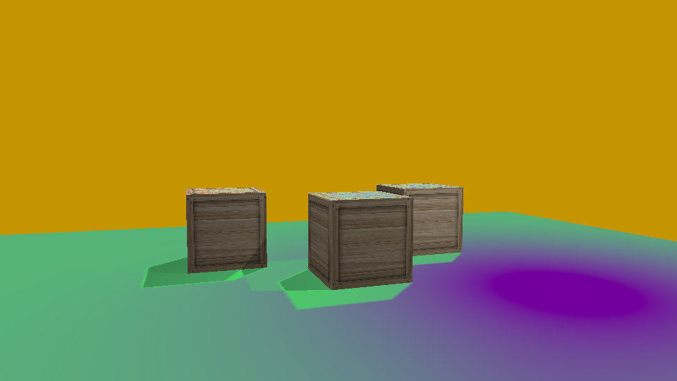 | 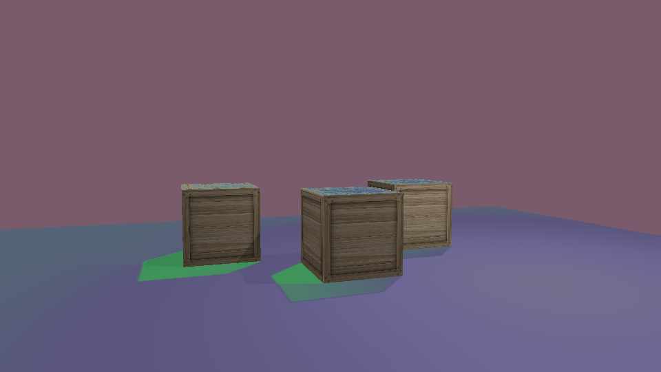 | 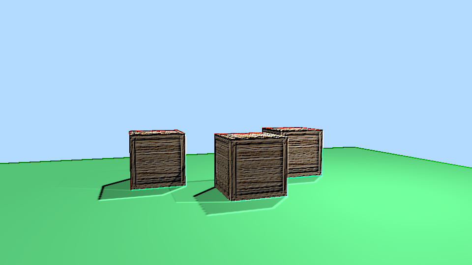 |
| Invert | Solarization | Sabattier effect | Emboss |
| 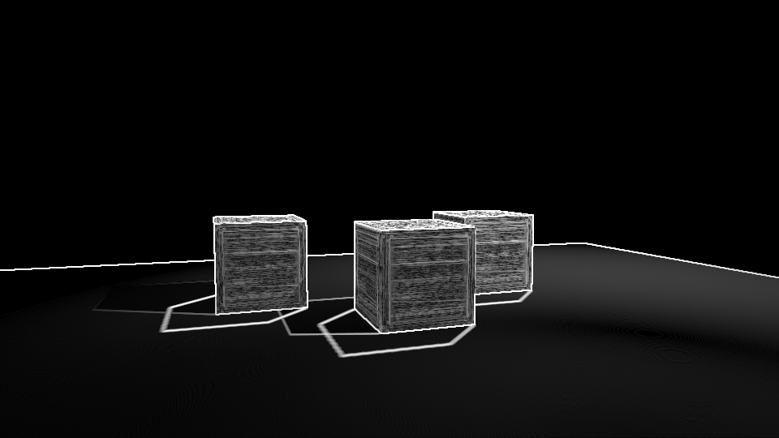 | 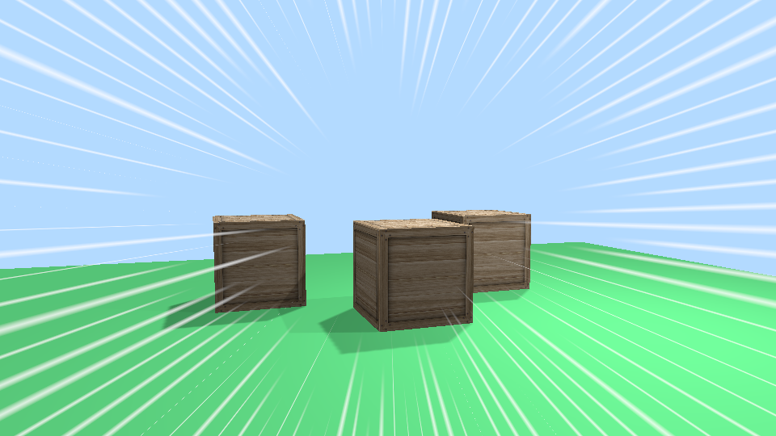 | 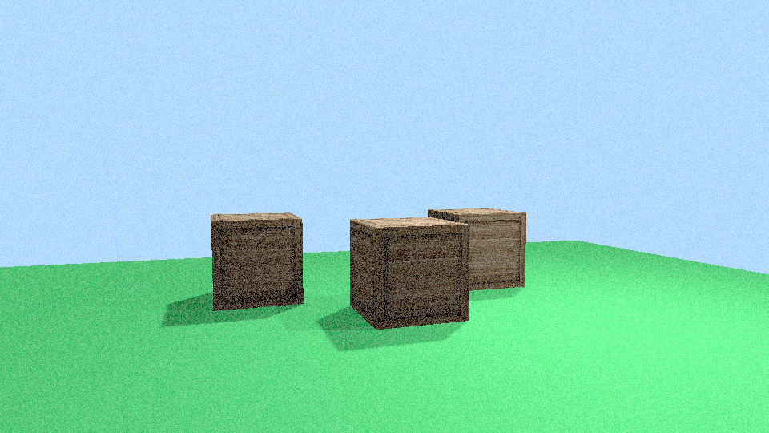 | 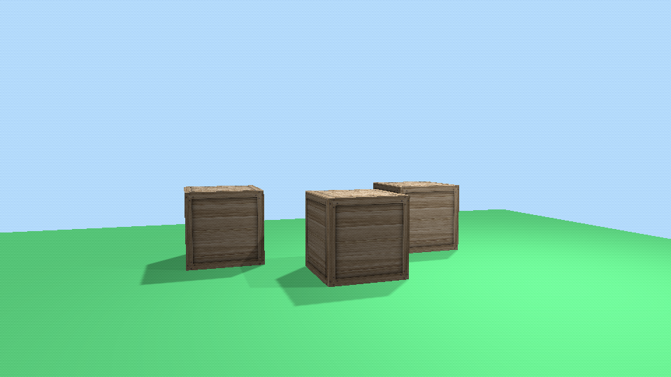 |
| Sobel | Speed lines | Film grain | Dithering (strength 32) |

## How it works

`apply` copies `src` with a blit into an internal `rgba16f` image. Each effect is one compute
dispatch that reads one internal image and writes the other. A final blit copies the result into
`dst`. The internal format lets the shaders work on HDR values and on sRGB swapchain images, which
cannot be storage images. Each frame in flight has its own pair of internal images. An effect's
pipeline is created the first time the effect is added. Its settings are recorded as push
constants.

## Adding an effect

1. Write `shaders/<name>.slang` like the existing shaders. The input image is at binding 0, the
   output image at binding 1, both `rgba16f`. The shader checks the image bounds, and its `Params`
   struct holds the push constants.
2. Add `<name>` to `SHADERS` in `CMakeLists.txt`. The build generates `<name>_spv.h`.
3. In `include/VVPPL.h`, add a settings struct with the same layout as `Params` (only `float`s,
   at most 128 bytes). Also add an `EffectType` entry at the effect's place in the chain, the
   `add`/`remove` declarations and a settings member.
4. In `src/VVPPL.cpp`, include `<name>_spv.h` and implement `add`/`remove` with `addEffect` and
   `removeEffect`.

## License

MIT, see [LICENSE](LICENSE).
